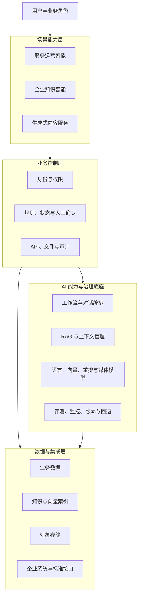

# 企业 AI 解决方案参考架构

> 面向 AI Solution Architect / AI Project Delivery 方向的个人作品集，展示从业务问题、架构决策到交付治理的方法。

> **保密声明：** 本仓库是独立设计的通用参考方案，不对应任何单一客户、雇主、项目或实际部署。能力组合、流程、界面、编号和数据均为重新设计的示例，不能据此还原任何真实项目。

## 我想展示什么

企业 AI 项目的难点通常不是“接入一个模型”，而是如何回答这些问题：

- 哪些环节适合使用 AI，哪些必须由规则或人工控制？
- 业务系统、AI 编排、模型服务和数据层应如何划分责任？
- RAG 如何同时处理知识质量、权限、版本、引用和反馈？
- 模型不稳定、检索无结果或外部接口失败时，系统如何降级？
- PoC 如何转化为可部署、可测试、可验收和可运营的方案？

本作品集以四个通用能力域回答这些问题，不复述某个具体项目的系统清单。

## 四个能力域

| 能力域 | 关注点 |
|---|---|
| [AI 能力与治理底座](capabilities/01-ai-foundation/README.md) | 模型接入、AI 编排、RAG、接口治理、监控与版本管理 |
| [服务运营智能](capabilities/02-service-operations/README.md) | 问题理解、证据检索、辅助决策、任务流转与知识回流 |
| [企业知识智能](capabilities/03-knowledge-intelligence/README.md) | 文档处理、权限检索、可信回答、引用与知识生命周期 |
| [生成式内容服务](capabilities/04-generative-content/README.md) | 模板化生成、人工编辑、异步媒体任务和内容治理边界 |

这些是可组合的架构能力，而不是对某家企业内部系统的映射。

## 参考架构



核心原则是：**业务后端管理确定性的状态和责任，AI 层处理需要语义理解与生成的任务。**

详细说明见 [总体架构](docs/architecture.md)。

## 关键架构判断

1. 前端不直接调用模型，所有请求经过身份、参数和权限校验。
2. AI 工作流不持有关键业务状态，也不替代业务状态机。
3. RAG 不只是向量检索，还包含知识治理、权限过滤、重排和引用。
4. AI 输出默认是建议；高影响操作需要规则校验或人工确认。
5. 当前设计与规模化演进分开描述，避免为了“完整”而过度设计。
6. 功能、性能、安全、准确性、监控和故障路径都应能被验收。

## 技术选型示例

技术名称仅用于说明我的选型思路，不代表任何实际环境。

| 能力 | 可选技术 | 评估重点 |
|---|---|---|
| AI 工作流 | Dify 或自研编排服务 | 迭代效率、可观测性、版本与扩展能力 |
| 语言模型服务 | vLLM 或兼容模型接口 | 模型适配、吞吐、延迟、资源和回退 |
| 语义检索 | Embedding、向量索引、Reranker | 召回率、权限、引用和评测 |
| 媒体工作流 | ComfyUI 或任务型生成服务 | 参数复现、异步状态、资源与内容边界 |
| 业务与文件存储 | 关系型数据库、对象存储 | 一致性、访问控制、保留和审计 |
| 可观测性 | 日志、指标和链路追踪工具 | 端到端定位、容量、失败和成本 |

## 交付方法

```text
业务场景与约束
  → 能力与风险评估
  → 参考架构和责任边界
  → PoC 与失败条件验证
  → 部署、测试和安全检查
  → 验收、运营与迭代
```

| 阶段 | 关键问题 |
|---|---|
| 场景发现 | 谁在什么条件下做什么决策，当前痛点能否量化？ |
| 方案设计 | 哪些能力复用，哪些状态留在业务系统，哪里需要人工控制？ |
| PoC 验证 | 除了成功样例，空检索、错误输入、超时和低置信结果如何处理？ |
| 工程准备 | 权限、日志、监控、版本、容量、回退和数据保留是否明确？ |
| 测试验收 | 需求是否能追溯到功能、性能、安全和质量验证？ |
| 运营改进 | 谁维护知识、规则和评测集，问题如何进入下一轮迭代？ |

完整方法见 [企业 AI 项目交付方法](docs/delivery.md)。

## 我的工作重点

- 将业务目标转化为场景范围、角色、流程和验收标准；
- 设计业务控制层、AI 编排层、模型服务和数据层的边界；
- 根据价值、风险、数据和团队条件进行技术选择；
- 设计知识、Prompt、模型、接口和评测的治理机制；
- 把安全、性能、监控、故障处理和回滚纳入交付计划；
- 协调业务、产品、AI、开发、基础设施、安全和运维角色；
- 控制范围和技术债，规划从试点到规模化的演进路径。

## 公开设计示例

下图用于说明“问题输入—证据检索—辅助判断—人工确认”的通用交互方式，不对应任何真实产品或项目。


## 项目结构

```text
enterprise-ai-solution-portfolio/
├── README.md
├── docs/
│   ├── architecture.md
│   ├── delivery.md
│   └── sanitization.md
├── capabilities/
│   ├── 01-ai-foundation/
│   ├── 02-service-operations/
│   ├── 03-knowledge-intelligence/
│   └── 04-generative-content/
└── assets/
    ├── architecture/
    └── screenshots/
```

## 公开边界

本仓库只展示通用方法、重新设计的参考架构和虚构界面，不包含或暗示：

- 客户、雇主、合作方及人员身份；
- 真实系统数量、命名、范围、流程或实施顺序；
- 源码、截图、需求文档、交付物或内部字段；
- 地址、账号、配置、部署拓扑、容量和测试数据；
- 可用于关联识别某个项目的信息组合。

完整规则见 [脱敏与去项目指纹说明](docs/sanitization.md)。
