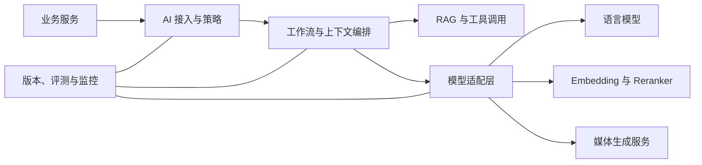

# AI 能力与治理底座

> 将模型、检索和工作流封装为可治理的共享能力，同时保持与业务状态解耦。

## 业务问题

企业中不同团队容易重复建设模型接口、知识检索和日志体系。试点数量增加后，模型版本、调用权限、质量和成本难以统一管理。

这一能力域关注的是“如何稳定提供 AI 能力”，而不是建设一个大而全的平台产品。

## 能力范围

- 统一接入语言、向量、重排和媒体类模型；
- 编排对话、检索、生成和工具调用流程；
- 提供知识处理与 RAG 公共能力；
- 管理认证、配额、超时、重试和错误语义；
- 记录模型、Prompt、工作流和知识版本；
- 观察调用量、延迟、失败、资源和质量指标；
- 为模型替换、降级和回退保留接口。

## 参考架构

## 关键边界

| 底座负责 | 业务系统负责 |
|---|---|
| 模型和工作流调用 | 用户身份与业务权限 |
| 检索、重排和上下文构建 | 权威业务状态 |
| 技术配额、监控与错误 | 业务规则和审批 |
| AI 资产版本关系 | 业务结果和责任归属 |
| 通用质量评测能力 | 场景验收标准 |

## 技术选择思路

| 能力 | 示例选择 | 需要验证 |
|---|---|---|
| 工作流编排 | Dify 或自研服务 | 调试、版本、扩展节点和运行可见性 |
| 模型服务 | vLLM 或兼容接口 | 模型适配、吞吐、延迟和资源利用 |
| 语义检索 | 向量索引与 Reranker | 召回、排序、权限过滤和引用质量 |
| 媒体流程 | ComfyUI 或任务型服务 | 参数复现、队列、状态和资源隔离 |
| 运行保障 | 容器、日志、指标与链路 | 部署重复性、定位效率和回退能力 |

这些技术是参考选项，不代表任何具体环境的组件清单。

## 失败与降级

- 模型不可用时返回明确错误，按场景选择备用模型或人工路径；
- 检索证据不足时不使用自由生成补齐专业事实；
- 工作流超时时保留可追踪状态，避免无限重试；
- 新模型或 Prompt 先通过评测，再小范围启用；
- 监控异常不阻塞核心调用，但必须留下可发现的运行信号；
- 媒体类长任务使用异步状态，不占用同步请求链路。

## 交付检查

- API 认证、权限、配额和输入限制；
- 模型、Prompt、工作流和知识版本关联；
- 单请求、并发、长稳和资源观察；
- 超时、空结果、依赖故障和回退路径；
- 输入安全、文件上传、信息泄露和越权检查；
- 运行手册、监控看板、问题升级和变更责任。

## 我希望展示的能力

- 能把 AI 技术能力抽象成稳定接口；
- 能区分共享平台职责与业务系统职责；
- 能根据阶段选择合适复杂度，而不是预设大型平台；
- 能把质量、安全、运行和成本纳入架构设计。
