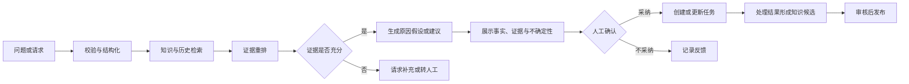
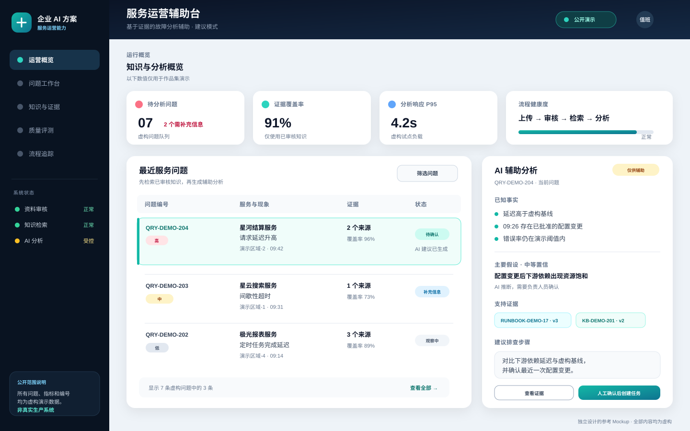

# 服务运营智能

> 使用知识检索和语义分析辅助处理服务问题，同时保持规则、状态和责任边界清晰。

## 业务问题

服务请求或运营问题常包含非结构化描述，处理人员需要在历史记录、知识文档和当前上下文之间反复查找。AI 可以帮助理解问题和组织证据，但不应绕过流程规则直接改变关键状态。

本能力域将问题分析、任务协同和经验沉淀视为一个通用闭环，不对应某种特定工单产品。

## 参考流程

## 核心设计

| 能力 | 设计重点 |
|---|---|
| 输入结构化 | 提取对象、现象、影响、时间和已有操作，保留原始描述 |
| 证据检索 | 结合关键词、语义、元数据、权限和有效期 |
| 辅助判断 | 区分已知事实、检索证据、AI 推断和待确认项 |
| 分类与推荐 | 规则优先，模型补充；返回理由和置信度 |
| 任务协同 | 由业务服务管理状态、责任人、时限和审计 |
| 知识回流 | 处理结果先成为候选，经审核后进入知识库 |

## 人机边界

- AI 可以补全摘要、推荐类别和组织排查步骤；
- AI 不强制写入关键字段，不自动跳转业务状态；
- 低置信、证据冲突或高影响场景直接转人工；
- 关键动作记录建议、人工选择和最终结果；
- 自动化程度随风险和评测结果逐步提高。

## 工程考虑

- 使用状态机而不是自然语言记录任务阶段；
- 对重复请求设置幂等标识；
- 长耗时分析通过流式结果或异步状态呈现；
- 外部接口超时后保留本地状态，并支持补偿或人工核对；
- 文件从上传、解析、引用到删除具有一致生命周期；
- 权限过滤必须在检索前执行，不能只依赖 Prompt。

## 评测与验收

| 维度 | 示例问题 |
|---|---|
| 输入质量 | 缺少关键字段时能否识别并请求补充？ |
| 检索质量 | 返回证据是否相关、有效且属于允许范围？ |
| 建议质量 | 建议是否可执行，是否明确区分事实与推断？ |
| 流程控制 | AI 建议能否被拒绝、修改和审计？ |
| 异常处理 | 模型、知识库或外部接口失败时状态是否一致？ |
| 运营闭环 | 反馈和处理结果能否进入评测与知识改进？ |

## 参考界面

下图完全使用虚构内容，用于说明证据化分析和人工确认方式。

## 我希望展示的能力

- 能把非结构化问题转为可控制的业务流程；
- 能同时设计 AI 建议、确定性规则和人工责任；
- 能处理跨系统状态、一致性和降级问题；
- 能把一次处理转化为可治理的知识资产。
