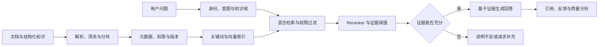

# 企业知识智能

> 将分散文档转化为有权限、有版本、可引用和可运营的知识服务。

## 业务问题

企业知识通常分散在文档、表格和业务系统中。普通聊天界面可以生成流畅回答，却无法自然解决权限、时效、版本冲突、证据不足和责任归属。

企业知识智能的核心不是聊天，而是知识生命周期与可信检索。

## 参考流程

## 核心能力

| 能力 | 设计重点 |
|---|---|
| 知识接入 | 支持常见文档格式，解析失败可见且可重试 |
| 清洗与分块 | 保留标题、章节、表格关系和可引用位置 |
| 权限与分域 | 在检索前根据用户和业务范围过滤 |
| 混合检索 | 结合关键词、向量、元数据和重排 |
| 可信回答 | 只使用允许的上下文，并展示可核对引用 |
| 生命周期 | 管理草稿、发布、更新、归档、回滚和有效期 |
| 反馈运营 | 收集空命中、低质量回答、纠错和过期知识 |

## 关键设计选择

### 检索前执行权限

不能先检索全部内容再让模型“不要泄露”。权限必须在候选知识进入上下文前生效。

### 证据不足时允许不回答

专业场景中，“不知道”通常比无依据的完整答案更安全。系统应设置证据阈值，并提供补充问题或人工路径。

### 引用需要验证

展示来源不代表回答已经正确。评测还需要检查引用片段是否真正支持结论，以及使用的版本是否有效。

### 图片输入与视觉理解分开

图片可先通过 OCR 提取文字进入检索；更复杂的图表、界面和空间关系理解应作为独立能力评估，不能因为支持上传图片就宣称具备完整多模态理解。

## 质量评测

- 检索召回率与排序质量；
- 回答是否被证据支持；
- 引用位置、版本和权限是否正确；
- 空命中和低置信时是否正确降级；
- 相同问题在知识更新前后的可解释变化；
- 用户反馈是否能转化为明确运营任务。

## 安全与运营

- 文件上传执行类型、大小、恶意内容和访问控制检查；
- 文档、片段、索引和缓存遵守同一权限与删除规则；
- 问答日志遵循最小化原则，敏感内容按策略脱敏；
- 知识所有者负责准确性和有效期，平台团队负责技术质量；
- Prompt、检索参数和模型变更通过评测集验证。

## 我希望展示的能力

- 能把 RAG 设计为完整的知识工程和运营体系；
- 能处理权限、版本、引用和更新之间的关系；
- 能为模型的不确定性设计安全的产品行为；
- 能把技术指标转化为业务可理解的验收问题。
