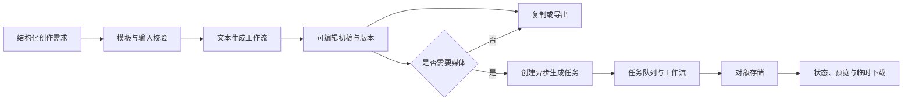

# 生成式内容服务

> 使用结构化模板和异步任务封装文本与媒体生成能力，帮助用户产出可编辑初稿。

## 业务问题

直接使用通用生成工具时，输入方式、输出结构和版本记录往往不统一；媒体生成还涉及长耗时任务、计算资源和文件交付。

本能力域关注“如何把生成能力安全地嵌入业务”，而不是建设自动创作或自动发布系统。

## 参考范围

- 使用主题、受众、语气、长度和语言等结构化输入；
- 通过模板和 Prompt 版本生成文本初稿；
- 支持编辑、复制、导出和历史版本；
- 使用简单规则提示高风险词语或格式问题；
- 按需创建异步媒体生成任务；
- 查询排队、运行、成功、失败、取消和超时状态；
- 通过对象存储和有时效地址交付生成文件；
- 记录任务、版本、耗时、失败和资源指标。

复杂多人审批、完整语义合规判断、视频生产和自动发布不作为默认能力。

## 参考架构

## 关键边界

| 能力 | 默认边界 |
|---|---|
| 文本生成 | 生成可编辑初稿，用户对最终内容负责 |
| 规则检查 | 提供提示，不替代法务、品牌或专业审核 |
| 媒体生成 | 通过任务接口执行，不阻塞文本编辑 |
| 内容安全 | 输入与输出策略需按风险单独设计，不夸大基础过滤 |
| 发布 | 默认导出或交付，不让模型直接向外部渠道发布 |
| 资产记录 | 保留必要的任务和版本关系，避免记录非必要正文 |

## 媒体任务设计

- 参数模板把业务选项映射为底层工作流参数；
- 创建任务后立即返回可查询标识；
- 限定重试次数，避免错误任务持续消耗资源；
- 取消请求根据当前状态处理，保留最终审计结果；
- 对象存储地址设置有效期和访问权限；
- GPU 或执行资源不足时保持明确排队状态。

节点式工具适合设计和验证媒体工作流，但不等于已经具备大规模推理能力。是否引入专用推理服务、容器编排和弹性扩缩，应由负载测试和隔离要求决定。

## 交付与验收

- 输入、模板、生成、编辑、版本和导出链路；
- 异步任务各状态及重复提交处理；
- 模型超时、队列拥塞、执行失败和存储故障；
- 文件访问权限、下载时效和历史查询范围；
- 生成耗时、失败率、队列长度和资源指标；
- 用户修改比例、模板复用率和实际采用率。

## 我希望展示的能力

- 能把生成式 AI 设计为可控的业务服务；
- 能区分同步交互与异步计算；
- 能准确表达基础过滤、人工责任和自动化边界；
- 能根据价值和风险控制 MVP 范围。
