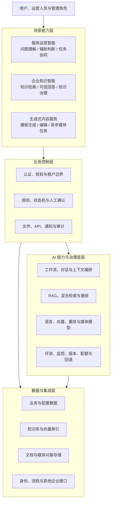

# 企业 AI 参考架构

## 架构定位

这是一套可按场景裁剪的参考架构，不对应某个组织的实际系统。它把企业 AI 能力分成四个能力域，并通过分层设计避免模型逻辑与业务控制相互污染。

## 总体分层

## 分层职责

| 层级 | 主要职责 | 不应承担 |
|---|---|---|
| 场景能力层 | 用户交互、业务语义、流程入口和结果呈现 | 直接管理模型资源 |
| 业务控制层 | 权限、状态、确定性规则、文件、接口、人工决策和审计 | 把关键状态交给 Prompt |
| AI 能力与治理底座 | 编排、检索、生成、评测、监控和模型适配 | 绕过权限改变业务事实 |
| 数据与集成层 | 数据持久化、知识索引、对象存储和标准连接 | 向模型暴露无边界的数据 |

## 能力域关系

- 服务运营智能把问题理解、证据检索、辅助建议和任务协同组合为可控流程。
- 企业知识智能负责知识接入、权限检索、可信回答和生命周期治理。
- 生成式内容服务面向结构化创作需求，并把媒体生成设计为异步任务。
- AI 能力与治理底座为其他能力域提供共享技术能力，但不持有业务责任。

## 关键架构决策

### 1. 业务控制与 AI 推理分离

业务后端保存权威状态，AI 编排只接收完成当前任务所需的最小上下文。这样可以独立替换模型或工作流，并保留确定性的权限和审计边界。

### 2. AI 输出默认是建议

分类、推荐、原因假设和生成内容都可能出错。对影响用户、资金、生产环境或合规结果的操作，必须增加确定性校验、人工确认或双重控制。

### 3. RAG 是知识治理流程

可信检索至少需要：

1. 文档解析与清洗；
2. 分块与元数据；
3. 访问权限和有效期过滤；
4. 关键词与向量混合召回；
5. 重排与证据阈值；
6. 引用、反馈和知识更新。

### 4. 异步任务使用显式状态

耗时生成或外部调用应有排队、运行、成功、失败、取消和超时等状态。调用方查询状态，而不是用无限重试或长连接掩盖不确定性。

### 5. 能力与规模分开设计

试点可以使用容器化模型服务、工作流平台和有限队列。只有在负载、隔离或可用性需求明确后，才评估集群调度、专用推理服务和自动扩缩。

## 横向治理

| 领域 | 设计问题 |
|---|---|
| 身份与权限 | 谁能调用能力、访问哪类知识、查看哪些历史结果？ |
| 数据最小化 | 模型实际需要哪些字段，日志需要保留什么？ |
| 版本与回退 | 模型、Prompt、知识、规则和工作流如何关联与回滚？ |
| 质量评测 | 成功率之外，如何评估正确性、引用质量和人工修改？ |
| 可观测性 | 如何贯通业务请求、工作流、模型、检索和外部接口？ |
| 故障处理 | 超时、空结果、低置信和依赖不可用时如何降级？ |
| 成本与容量 | 如何限制配额、并发、上下文长度和媒体生成资源？ |

## 架构演进原则

参考架构不预设所有企业都需要相同组件。演进应由可观察的约束驱动：

- 先验证业务价值和失败边界，再增加平台复杂度；
- 先建立接口和责任边界，再替换底层技术；
- 先有可重复的质量评测，再讨论模型升级；
- 先明确数据和运营责任，再扩大用户与知识范围。
